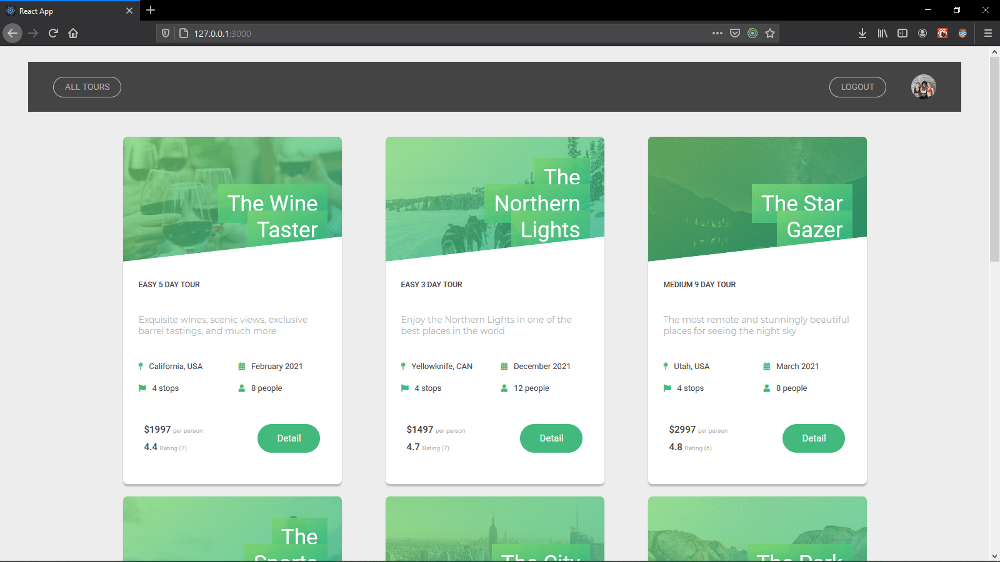

# Natours With React

---

## About

This is the "Natours" project written in Javascript and its my first fullstack project and it has a full feature API with json-web-token authentication and sending Email and reset password and forgot password functionality it also has the Stripe in it

---

## Installing

`npm install` run it in **Client** , **Root Dir**

### Server Side Keys:

**.env** file with these api keys:

`EMAIL_USERNAME=YOUR_EMAIL_USERNAME`

`EMAIL_HOST=YOUR_EMAIL_HOST`

`EMAIL_PASSWORD=YOUR_EMAIL_PASSWORD`

`EMAIL_PORT=YOUR_EMAIL_PORT`

`STRIPE_SECRET_KEY=YOUR_STRIPE_API_KEY`

### Client Side

**.env** file with these api keys:

`REACT_APP_MAPBOX_TOKEN=YOUR_MAPBOX_API_KEY`

---

## Built With

- Node
- Express
- MongoDB
- Mongoose
- React
- Redux
- Jwt
